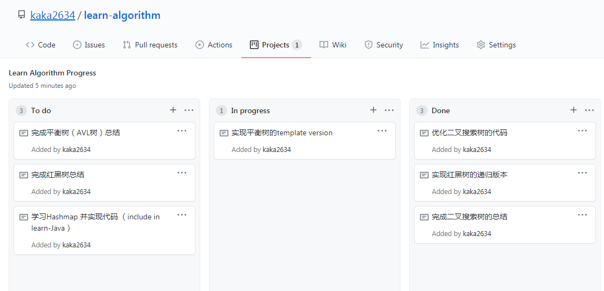

# 算法学习

一个总结个人学习数据结构和算法的仓库:bowtie:

使用代码：C++

### 完成清单
#### 数据结构
- [并查集 disjoint_set](disjoint_set) 
- [线段树 segment_tree](segment_tree) 
- [字典树 trie_tree](trie_tree) 
- [动态数组 vector](vector)
- [二叉堆 heap](heap)
- [二叉搜索树 binary_search_tree](binary_search_tree)    
- [AVL平衡搜索树 avl_tree](avl_tree) 
- [红黑树 black_red_tree](black_red_tree) 

#### 算法
- [图的算法](graph)
- [kmp算法](kmp)

#### 总结笔记
- [动态数组 vector](vector)
- [二叉堆 heap](heap)  
- [二叉搜索树 binary_search_tree](binary_search_tree)    

### 任务进度
以下截图可能存在更新延迟，查看最新任务进度，戳链接 :point_right: [最新项目进展](https://github.com/kaka2634/learn-algorithm/projects/1)

