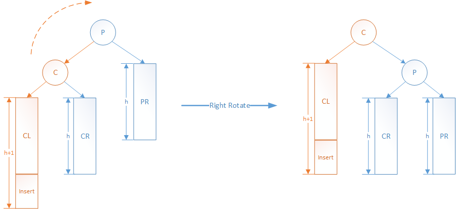
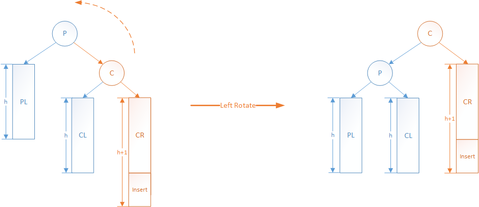
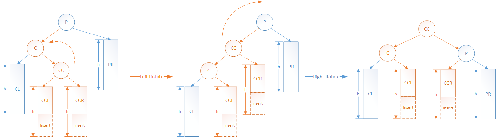
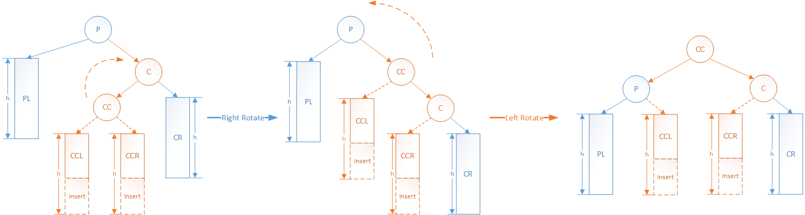

# AVL树

## 1.AVL树的概念
**AVL树 (Adelson-Velsky and Landis Tree)** 是计算机科学中最早被发明的**自平衡二叉查找树**。AVL树得名于它的发明者G. M. Adelson-Velsky和Evgenii Landis，他们在1962年的论文《An algorithm for the organization of information》中公开了这一数据结构。

**在AVL树中，任一节点对应的两棵子树的最大高度差为1，因此它也被称为高度平衡树。**

因为树的高度是平衡的，避免了一般二叉搜索树退化成链表的情况，所以AVL树的查找、插入和删除在平均和最坏情况下的时间复杂度都是$O(logn)$。

在插入和删除操作之后，可能需要借由一次或多次树旋转，以实现树的重新平衡。

## 2.AVL树的实现

### 2.1 节点结构
```
template <class K, class V>
class Node {
public:
    K key;
    V value;
    Node<K, V>* left;
    Node<K, V>* right;
    Node(K key_, V value_)
    {
        key = key_;
        value = value_;
        left = nullptr;
        right = nullptr;
    }
};
```
### 2.2 基本接口
``` 
  //单旋转
  Node<K, V>* LL_rotate(Node<K, V>* p);
  Node<K, V>* RR_rotate(Node<K, V>* p);

  //双旋转
  Node<K, V>* RL_rotate(Node<K, V>* p);
  Node<K, V>* LR_rotate(Node<K, V>* p);

  //平衡 (AVL树的关键)
  Node<K, V>* balance(Node<K, V>* p);

   //插入，查找，删除
  Node<K, V>* insert(Node<K, V>* p, K key, V value);
  Node<K, V>* find(Node<K, V>* p, K key);
  Node<K, V>* remove(Node<K, V>* p, K key);

  //返回最大节点和最小节点，用于找前继节点和后继节点
  Node<K, V>* find_max(Node<K, V>* p);
  Node<K, V>* find_min(Node<K, V>* p);

```

### 2.2 四种旋转

首先，在介绍旋转之前，首先对AVL树的插入和删除操作要再次明确一下
- 对于插入操作:
    - 插入数据一定是在叶子节点上
    - 插入数据之前，AVL树一定是满足平衡条件的
    - 插入数据之后，AVL树可能会被打破平衡，这时候就需要对树进行旋转操作来实现重新平衡
- 对于删除操作:
    - 删除数据也可以替换为在叶子节点上删除
    - 删除数据之前，AVL树一定是满足平衡条件的
    - 删除数据之后，同样可能会打破AVL树的平衡，这时候也需要对树进行旋转操作实现重新平衡

根据打破平衡情况的不同，可以将场景罗列成四种。针对四种情况，将会有四种旋转方式。

我们将四种情况和旋转方式用图来表示，这里先对图中的节点给出定义： 
- P : parent 节点。同时, PL 表示 P 节点的左子树， PR 表示 P 节点的右子树。
- C : child 节点。同时, CL 表示 C 节点的左子树， CR 表示 C 节点的右子树。
- CC: child 的 child 节点。同时, CCL 表示 CC 节点的左子树， CCR 表示 CC 节点的右子树。

在图示中，只画出了插入节点后，打破平衡的情况。而对于删除操作，可以理解成另一边的子树，减去了一个节点，同样类似插入节点失去平衡的情况，这里可以自行想象。

#### 右旋



#### 左旋


#### 先左旋后右旋


#### 先右旋后左旋


### 2.3 平衡


### 2.4 插入

相比于一般二叉搜索树，插入后增加了平衡操作
```
template <class K, class V>
void AVLTree<K, V>::insert(K key, V value)
{
    root = insert(root, key, value);
}

template <class K, class V>
Node<K, V>* AVLTree<K, V>::insert(Node<K, V>* p, K key, V value)
{
    //终结条件1: 到达null节点，需新建节点返回，完成插入
    if (p == nullptr) {
        p = new Node<K, V>(key, value);
        return p;
    }

    //终结条件2：如果key相同，那么只需更新value，这里等同update操作
    if (p->key == key) {
        p->value = value;
        return p;
    }

    //否则就需要继续寻找子树
    if (key < p->key) {
        p->left = insert(p->left, key, value);
    } else {
        p->right = insert(p->right, key, value);
    }

    //注意：这里相比一般二叉搜索树，在这里增加了平衡语句，这是两者的唯一区别
    //因为平衡操作可能导致根节点变化，同样将返回值用于更新根节点返回
    p = balance(p);
    return p;
}
```
### 2.4 查找
与一般二叉搜索树相同
```
template <class K, class V>
Node<K, V>* AVLTree<K, V>::find(K key)
{
    return find(root, key);
}

template <class K, class V>
Node<K, V>* AVLTree<K, V>::find(Node<K, V>* p, K key)
{
    //终结条件: 到达null节点，或者找到对应节点
    if (p == nullptr || p->key == key) {
        return p;
    }

    //根据二叉搜索树的性质继续寻找
    if (key < p->key) {
        return find(p->left, key);
    } else {
        return find(p->right, key);
    }
}
```
### 2.5 删除

相比于一般二叉搜索树，增加了删除后的平衡操作
```
template <class K, class V>
void AVLTree<K, V>::remove(K key)
{
    root = remove(root, key);
}

template <class K, class V>
Node<K, V>* AVLTree<K, V>::remove(Node<K, V>* p, K key)
{
    //终结条件1: 到达null节点，仍然没能找到，返回nullptr
    if (p == nullptr) {
        return p;
    }

    //终结条件2： 找到删除节点
    if (p->key == key) {
        //1. 如果没有左右孩子，直接删除该节点
        if (p->left == nullptr && p->right == nullptr) {
            delete p;
            p = nullptr;
            return p;
        }

        //2. 如果只有一个孩子，那么直接将孩子节点作为替换节点, 同时删除节点
        if (p->left == nullptr) {
            Node<K, V>* replace = p->right;
            delete p;
            p = nullptr;
            return replace;
        } else if (p->right == nullptr) {
            Node<K, V>* replace = p->left;
            delete p;
            p = nullptr;
            return replace;
        }

        //3. 剩下就是左右孩子都存在的情况
        //注意： 这里与一般二叉搜索树的区别，在于要根据树高选择前驱/后继节点作为替换节点
        int p_factor = get_balance_factor(p);
        if (p_factor > 0) {
            //3.1 左子树更高,则将根节点的值更换为前驱节点
            Node<K, V>* replace = find_max(p->left);
            p->key = replace->key;
            p->value = replace->value;
            p->left = remove(p->left, replace->key);
        } else {
            //3.2 右子树更高, 则将根节点的值更换为后继节点
            Node<K, V>* replace = find_min(p->right);
            p->key = replace->key;
            p->value = replace->value;
            p->right = remove(p->right, replace->key);
        }

        //注意： 这里需要用else if，因为key的值可能会在前面替换节点时被修改了
    } else if (key < p->key) {
        p->left = remove(p->left, key);

    } else {
        p->right = remove(p->right, key);
    }
    //注意： 最后要对节点进行平衡操作
    p = balance(p);
    return p;
}
```

## 3.最后

#### 3.1 完整代码与测试
头文件：[avl_tree_improve.h](avl_tree_improve.h)
cpp文件：[avl_tree_improve.cpp](avl_tree_improve.cpp)

运行结果：
```
*************************************
After insert 10, 40, 30, 60, 90, 70, 20, 50, 80:
Pre order traverse: 60 30 10 20 40 50 80 70 90
Mid order traverse: 10 20 30 40 50 60 70 80 90
*************************************
Remove 80 tree balance check: 1
Remove 10 tree balance check: 1
Remove 50 tree balance check: 1
Remove 40 tree balance check: 1
*************************************
After remove 80, 10, 50, 40:
Pre order traverse: 60 30 20 90 70
Mid order traverse: 20 30 60 70 90
```

#### 3.2 参考文档
Wiki - AVL树: [https://zh.wikipedia.org/wiki/AVL%E6%A0%91](https://zh.wikipedia.org/wiki/AVL%E6%A0%91)

平衡二叉树(AVL)原理解析与实现(C++): [https://juejin.cn/post/6844904006033080333](https://juejin.cn/post/6844904006033080333)